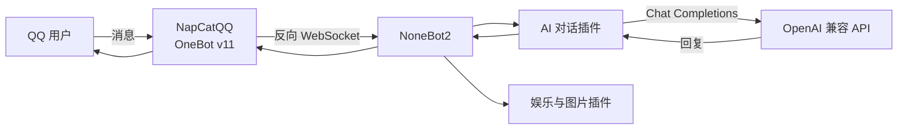

<div align="center">

# QQ AI Bot

<p align="center">
  基于 NoneBot2 与 OneBot v11 的 QQ AI 机器人<br>
  支持连续对话、角色扮演、知识问答、棋类游戏与表情包生成
</p>

<p align="center">
  
  
  
  <a href="LICENSE"></a>
</p>

<p align="center">
  <a href="#功能一览">功能一览</a> ·
  <a href="#快速开始">快速开始</a> ·
  <a href="#配置说明">配置说明</a> ·
  <a href="#工作原理">工作原理</a> ·
  <a href="#常见问题">常见问题</a>
</p>

</div>

---

这个项目将 QQ 消息通过 [NapCatQQ](https://github.com/NapNeko/NapCatQQ) 转发给 [NoneBot2](https://nonebot.dev/)，再调用 OpenAI 兼容接口生成回复。除了 AI 对话，项目还加载了棋类、一言、随机老婆、PetPet 和 Memes 等 NoneBot 插件。

> [!NOTE]
> 仓库名中的 `claude` 是历史命名。当前实现使用 OpenAI Python SDK，可通过 `OPENAI_BASE_URL` 接入 OpenAI 或其他兼容服务。

## 功能一览

| 分类 | 功能 | 常用入口 |
| --- | --- | --- |
| AI 对话 | 连续对话、上下文记忆、@机器人直接提问 | `你好`、`再见`、@机器人 |
| 角色扮演 | 柯南、猫娘、古代谋士、毒舌导师 | `/角色扮演`、`/退出角色` |
| 知识问答 | AI 出题、提交答案、自动判定 | `/问答`、`/答案` |
| 轻娱乐 | 塔罗牌、笑话、一言、随机老婆 | `/塔罗`、`/笑话`、`一言`、`/抽老婆` |
| 棋类游戏 | 五子棋、围棋、黑白棋 | `/五子棋`、`/围棋`、`/黑白棋` |
| 图片生成 | 头像互动 GIF 与文字梗图 | `摸 @某人`、`表情包制作` |

在 QQ 中发送 `/help` 可以查看机器人内置的完整指令说明。

## 工作原理



项目本身负责 NoneBot 启动、OneBot 适配器注册和插件加载；QQ 登录与协议连接由 NapCatQQ 负责。

## 快速开始

### 1. 准备环境

- Python 3.9 或更高版本
- 一个可用的 OpenAI 兼容 API Key
- 支持 OneBot v11 的 QQ 协议实现，本项目推荐 NapCatQQ

克隆仓库：

```bash
git clone https://github.com/xw9114/qq-claude-bot.git
cd qq-claude-bot
```

### 2. 安装依赖

<details open>
<summary><strong>Windows</strong></summary>

```bat
setup.bat
```

</details>

<details>
<summary><strong>Linux / macOS</strong></summary>

```bash
chmod +x setup.sh start.sh
./setup.sh
```

</details>

安装脚本会创建 `venv`、安装 `requirements.txt`，并在本地不存在 `.env` 时复制配置模板。

### 3. 配置 API

打开项目根目录下的 `.env`，至少填写：

```env
OPENAI_API_KEY=your-api-key
OPENAI_BASE_URL=https://api.openai.com/v1
```

`.env` 已被 Git 忽略。请勿将真实密钥写入 README、截图、Issue 或提交记录。

### 4. 连接 NapCatQQ

1. 安装并登录 [NapCatQQ](https://github.com/NapNeko/NapCatQQ/releases)。
2. 新建 OneBot v11 反向 WebSocket（Universal）连接。
3. 将连接地址设为：

```text
ws://127.0.0.1:8080/onebot/v11/ws
```

如果修改了 `.env` 中的 `HOST` 或 `PORT`，需要同步修改该地址。

### 5. 启动机器人

| 系统 | 命令 |
| --- | --- |
| Windows | `start.bat` |
| Linux / macOS | `./start.sh` |
| 已激活虚拟环境 | `python bot.py` |

看到 OneBot 连接日志后，在 QQ 中发送“你好”或 @机器人即可开始对话。

## 配置说明

配置模板位于 [`.env.example`](.env.example)。

| 配置项 | 必填 | 默认值 | 说明 |
| --- | --- | --- | --- |
| `OPENAI_API_KEY` | 是 | - | OpenAI 或兼容服务的 API Key |
| `OPENAI_BASE_URL` | 否 | SDK 默认地址 | OpenAI 兼容接口地址 |
| `OPENAI_MODEL` | 否 | `gpt-5.4-mini` | 对话、问答和娱乐功能使用的模型 |
| `DRIVER` | 是 | `~fastapi+~httpx+~websockets` | NoneBot 驱动器组合 |
| `HOST` | 否 | `127.0.0.1` | NoneBot 监听地址 |
| `PORT` | 否 | `8080` | NoneBot 监听端口 |
| `COMMAND_START` | 否 | `["/"]` | 命令前缀 |
| `SUPERUSERS` | 否 | `[]` | 超级用户 QQ 号集合 |
| `TITLE_ADMINS` | 否 | `[]` | 允许设置和删除全局用户称号的 QQ 号列表 |
| `BOT_GLOBAL_SEND_INTERVAL` | 否 | `1` | 所有发送操作之间的最小间隔，单位为秒 |
| `BOT_GROUP_SEND_INTERVAL` | 否 | `3` | 同一群内两次发送之间的最小间隔，单位为秒 |
| `BOT_USER_SEND_COOLDOWN` | 否 | `5` | 同一用户触发两次发送之间的最小间隔，单位为秒 |
| `DATABASE_URL` | 否 | SQLite | 棋类等插件使用的数据库地址 |
| `BOARDGAME_TIMEOUT` | 否 | `600` | 棋局超时时间，单位为秒 |
| `MEMES_COMMAND_PREFIXES` | 否 | `["/"]` | Memes 使用独立前缀，避免与 PetPet 指令冲突 |

当前 AI 模型可通过 `.env` 中的 `OPENAI_MODEL` 设置；使用兼容服务时，应填写该服务实际提供的模型名称。

称号管理员可以使用 `/设置称号 QQ号 称号`、`/设置称号 @用户 称号`、`/查看称号 QQ号` 和 `/删除称号 QQ号` 管理全局用户身份。使用真实 @ 设置时，机器人会优先记录群名片或昵称；也可以用 `/设置称号 QQ号 称号 | 显示名` 手动指定聊天展示名。称号数据保存在 `data/user_titles.db`，机器人重启后仍然有效。聊天中提到已登记称号时，机器人会自动把称号当作对应用户的代称来理解。

所有 OneBot 发送操作都会进入全局队列，AI、PetPet、Memes 和棋类等插件共用同一套限流规则。群聊回复同时受全局间隔、同群间隔和触发用户冷却限制，以其中等待时间最长的一项为准。

### 检查 API 连通性

完成 `.env` 配置后运行：

```bash
python test_api.py
```

测试脚本不会输出 API Key，只会报告连接结果与模型回复。

## 项目结构

```text
qq-claude-bot/
├── bot.py                  # NoneBot 入口与第三方插件加载
├── plugins/
│   └── claude_chat.py      # AI 对话、角色扮演、问答与娱乐指令
├── .env.example            # 可公开的配置模板
├── requirements.txt        # Python 依赖
├── setup.bat / setup.sh    # 环境初始化脚本
├── start.bat / start.sh    # 启动脚本
└── test_api.py             # API 连通性测试
```

虚拟环境、日志、缓存、数据库、插件资源和本地备份均不会纳入 Git。

## 常见问题

<details>
<summary><strong>NapCatQQ 已启动，但机器人没有收到消息</strong></summary>

- 确认反向 WebSocket URL 为 `ws://127.0.0.1:8080/onebot/v11/ws`。
- 检查 NoneBot 日志中是否出现 OneBot 连接记录。
- 确认 NapCatQQ 的连接类型是 OneBot v11 反向 WebSocket。
- 如果修改过监听地址或端口，确保两端配置一致。

</details>

<details>
<summary><strong>AI 功能提示“API 未配置”</strong></summary>

- 确认 `.env` 位于项目根目录。
- 确认配置名是 `OPENAI_API_KEY`，不是旧版的 `ANTHROPIC_API_KEY`。
- 运行 `python test_api.py` 检查接口和模型是否可用。

</details>

<details>
<summary><strong>Memes 插件在 Windows 下无报错退出</strong></summary>

安装 [Microsoft Visual C++ Redistributable](https://aka.ms/vs/17/release/VC_redist.x64.exe) 后重试。

</details>

## 安全说明

- 不要提交 `.env`、数据库、日志或包含密钥的压缩备份。
- 如果密钥曾进入公开提交，应立即在服务商后台撤销并重新生成。
- 建议使用独立的机器人 QQ 账号，并遵守 QQ、NapCatQQ 与 API 服务商的使用规则。

## 许可证

本项目使用 [MIT License](LICENSE)。
